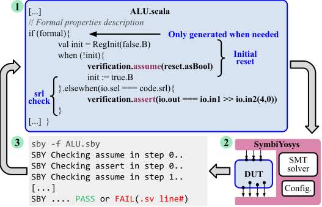

# Formal Verification in Chisel3 HCL

You've done the [Chisel Tutorial](https://github.com/ucb-bar/chisel-tutorial), and now you are ready to start your own formal verification for your Chisel project.  The following procedure should get you started with a clean running [Chisel3](https://www.chisel-lang.org/) project.

## Apply formal verification to your own Chisel3 project

### Prerequisites
Please Install the following tools from this [link](https://symbiyosys.readthedocs.io/en/latest/install.html)
- Yosys, Yosys-SMTBMC and ABC
- SymbiYosys
#### Formal engines:
- Yices 2
- Z3
- Boolector

## SystemVerilog Generation
To generate a SystemVerilog file from your Chisel project run the following command

- ./do-gen.sh
